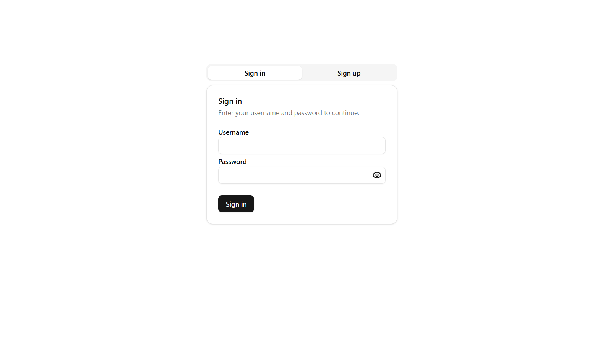
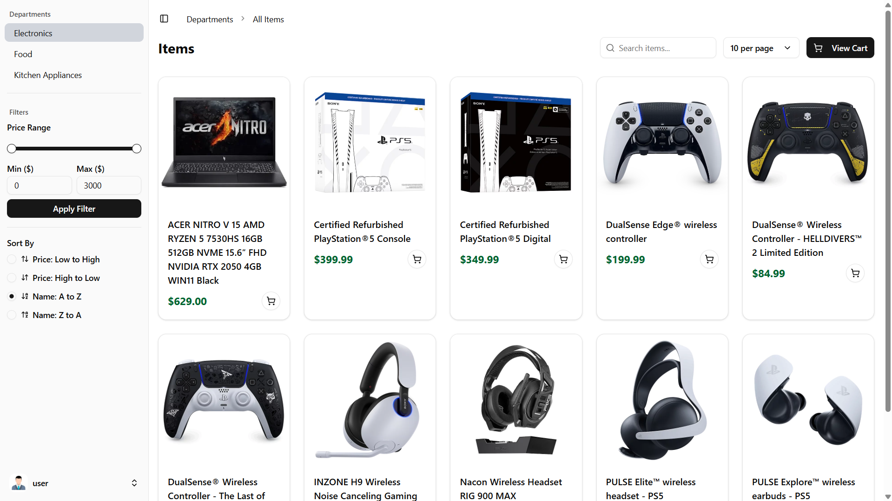
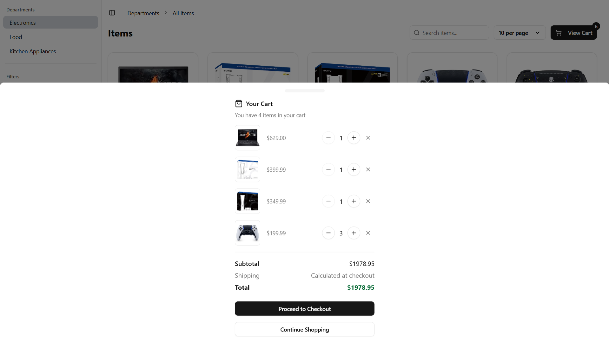
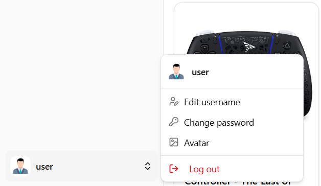
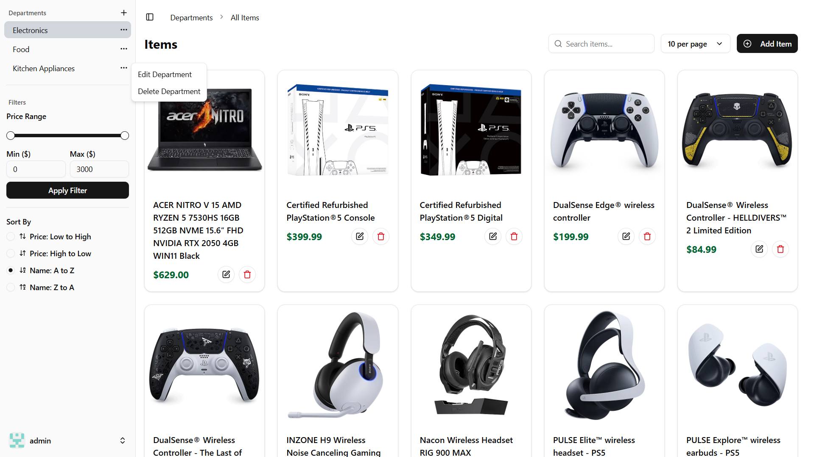

# Department Store Website

A simple yet functional web application that allows users to sign in/sign up, browse items by department, add them to a cart, and filter by price. An admin panel is also included for managing departments and items.

> 💼 *This was my first full-stack project using React and .NET (also my first time using react and C#), completed during my internship at [SEG International](https://azseg.com/). It helped me gain hands-on experience with modern web development, authentication, state management, REST APIs, and database design.*

---

## 🧾 Features

- 🔐 **User Authentication**
  - Sign up / Log in system

- 👤 **Account Customization**
  - Users can:
    - Change their username
    - Update their password
    - Upload or change their avatar/profile picture

- 🛒 **Shopping Cart Functionality**
  - Add multiple items from different departments to the cart
  - View and manage cart contents

- 📦 **Department Management**
  - Users can select departments
  - Each department contains its own list of items

- 🔍 **Filtering & Sorting**
  - Filter items by price range
  - Sort items by:
    - Name (A–Z or Z–A)
    - Price (low to high or high to low)

- 🔎 **Search Functionality**
  - Search for items across all departments by name

- 📖 **Pagination**
  - Large item lists are paginated for better performance and usability
  - The user can change the number of items per page

- 🖼️ **Image Uploads for Items**
  - Admin can upload custom images for each item
  - Images are displayed in item listings and cart previews

- 👤 **Admin Panel**
  - One designated admin account
  - Admin can:
    - Add, edit, and delete departments
    - Add, edit, and delete items within departments

---

## 🛠️ Tech Stack

This project uses the following technologies:

- Built with [React](https://reactjs.org/ )
- Styled with [Tailwind CSS](https://tailwindcss.com/ ) and [Shadcn](https://ui.shadcn.com/)
- Backend powered by [.NET Core](https://dotnet.microsoft.com/ )

---

## 📸 Screenshots

> **Login Page**



> **Homepage with Departments**



> **Cart Page**



> **User Customization**



> **Admin Dashboard**



---

## 🧑‍💻 Admin Access (For Demo Purposes)

- **Username :** admin
- **Password :** admin

---

## 🚀 How to Run Locally

Follow these steps to run the application on your local machine.

### 1. **Clone the repository**

```bash
git clone https://github.com/your-username/department-store.git 
```

### 2. **Run the Frontend**

Navigate to the frontend directory and start the development server:

```bash
cd App1-Frontend
npm install
npm run dev
```

The frontend will be available at `http://localhost:3000`.

---

### 3. **Set Up and Run the Backend**

The backend is built using **.NET**, so you'll need the .NET SDK installed.

#### a. Navigate to the backend folder:

```bash
cd App1-Backend
```

#### b. Restore dependencies

```bash
dotnet restore
```

#### c. Create and Migrate the Database

> ⚠️ Make sure you're in the `App1-Backend\Infrastructure` folder before proceeding.

Using the **Package Manager Console** in **Visual Studio 2022**, run:

```powershell
Add-Migration InitialCreate
Update-Database
```

> Replace `InitialCreate` with a meaningful migration name if needed.

#### d. Start the backend server

> ⚠️ Go back to the `App1-Backend\App1CleanArchitecture` folder before proceeding.

```bash
dotnet run
```

The backend will start running at `http://localhost:5036` or similar (depends on your configuration).

---

### ✅ You're all set!

Now you can access the app at `http://localhost:3000` and interact with the backend APIs running on `http://localhost:5036`.
